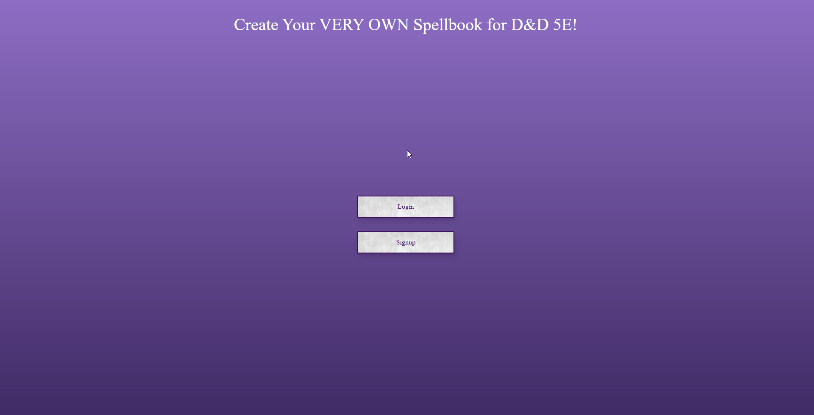
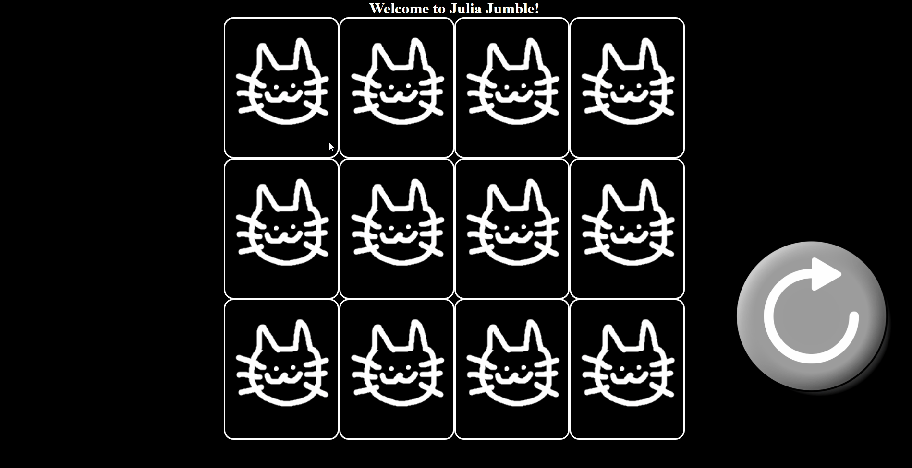

  
  
  
  

As a mechanical engineer turned software engineer,  I view myself as a tabula rasa due to my ability of being able to learn and retain new skills and traits I have been taught throughout my academic and professional career. I wish to create pathways and foundations for both small and big companies to bring longevity and prosperity into many aspects of our day-to-day lives while continuing to grow as a person and as a software engineer.

See my [website](https://adambryant.netlify.app/) for more information!

<h1 align="center">Projects</h1>
<table bordercolor="#66b2b2">
  
  <tr>
    <td width="50%" valign="top">
      <h3 align="center">D&D 5e Spellbook</h3>
         
        
         
        

         
  
      

        
<strong>Javascript, Passport.js, Node.js, Express.js, & MongoDB</strong> - Tool used to create your very own D&D 5e spellbook! With passport authenticaton, you are able to have unique spellbooks for different characters. 

    </td>
    <td width="50%" valign="top">
      <h3 align="center">Falconia Flowers</h3>
         
      
         
        

          
  
  
      

        
<strong>HTML5, CSS3, & Javascript</strong> - An online flower shop that delivers your order right to you! From our gardens to your doorstep.

    </td>
  </tr>
  
  <tr>
    <td width="50%" valign="top">
      <h3 align="center">My Portfolio</h3>
       
        
       
        

  
  
      

        
<strong>HTML5, CSS3, & Javascript</strong> - My portfolio with links to more of my projects as well as ways to contact me.

    </td>
    <td width="50%" valign="top">
      <h3 align="center">Julia Jumble</h3>
         
        
         
        

          
  
  
      

        
<strong>HTML5, CSS3, & Javascript</strong> - A simple matching card with pictures of my cat Julia as the front of the cards!

    </td>
  </tr>
</table>

<h1 align="center">Skills / Technologies</h1>

    
    
    
    
    
    
    
    
    
    

---

<h1 align="center">Connect</h1>

  
  
  
  

